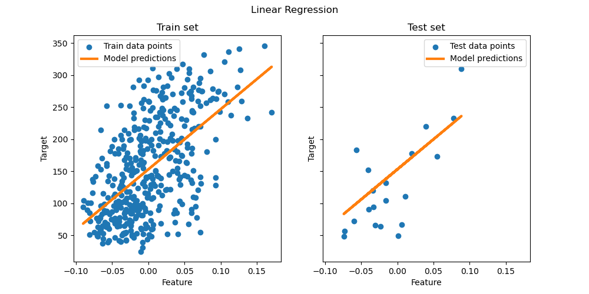

# 线性模型
一系列回归分析方法，目标输出可由特征变量线性组合得到。用数学符号表示，预测值$\hat{y}$可以写作：
$$
\hat{y}(w,x)=w_0+w_1x_1+...+w_px_p
$$
我们定义向量$w=(w_1,...,w_p)$为`coef_`(系数向量),$w_0$为`intercept_`(截距项)
## Ordinary Least Squares 普通最小二乘法
`LinearRegression`拟合一个带系数$w=(w_1,...,w_p)$的线性模型，最小化数据集中真实目标值与线性近似预测目标值之间的残差平方和。从数学角度来说，它求解如下形式的优化问题：
$$
\min\limits_{w}\|\boldsymbol{Xw-y}\|_2^2
$$

线性回归模型的`fit`方法接收参数自变量矩阵`X`，目标向量`y`以及样本权重`sample_weight`，并将线性模型的系数存储在自身属性`coef_`与截距`intercept_`中

普通最小二乘法的系数估计依赖特征之间相互独立的前提。若特征存在相关性，且设计矩阵的部分列向量近似呈线性相关关系，则该设计矩阵会趋近奇异矩阵。由此，最小二乘估计结果对观测目标值中的随机误差极度敏感，会产生极大方差。这种多重共线性问题可能出现的场景举例：未经过实验设计直接采集数据时。

Example:见`Ordinary_Least_Squares_and_Ridge_Regression.ipynb`

### Non-Negative Least Squares 非负最小二乘法

